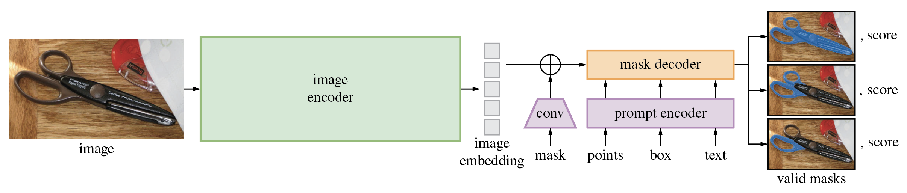
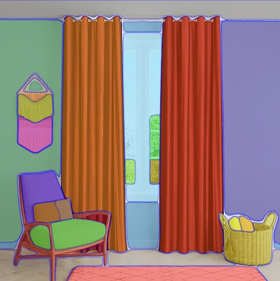
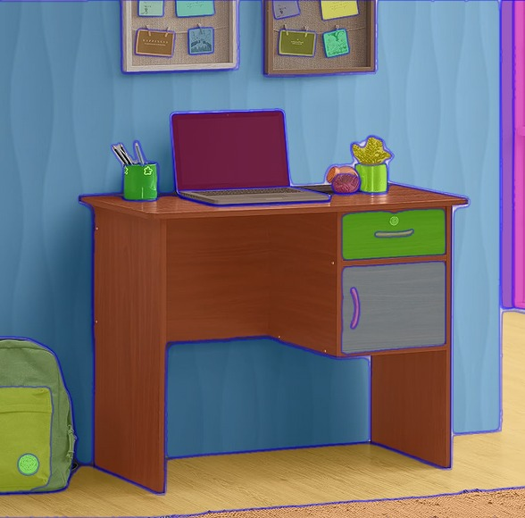

# SAM Inpaint - A segmented approach towards AI based image editing 


<br/>

## About this repository

This repository documents and maintains the solution for the Scene-Composition Assignment (H3) provided by Avataar. Completing this task has been an invaluable learning experience, allowing me to explore advanced generative AI techniques for object segmentation and image manipulation. By working through real-world applications such as repositioning objects in product scenes, I gained hands-on experience with cutting-edge models like SAM (Segment Anything Model) and Stable Diffusion Inpainting. This project showcases my ability to creatively solve complex image-editing tasks using AI tools and existing models. 

<br/>

## About this project

Recent advancements in generative AI have enabled the development of creative workflows for image editing. One such workflow is leveraging generative AI techniques to modify product photographs after they've been captured in a studio setting. For example, e-commerce platforms often require adjustments to product scenes, such as repositioning objects within the scene for better display.

This project involves two primary tasks to achieve a user-friendly functionality for moving objects in a scene. The first task is to segment an object (identified by a user-provided class prompt) in a given image. This segmentation step is critical for creating an intuitive editing experience. The second task is to reposition the segmented object based on user inputs, such as specifying the number of pixels to shift horizontally and vertically. The final output should be a realistic and well-composited image where the object appears in its new location.

<br/>

## Approach to edit segmented prompts

To complete this assignment, I used a combination of pre-trained generative AI models to segment and reposition objects in images. By leveraging Segment Anything Model (SAM) for object segmentation and Stable Diffusion Inpainting for seamless background reconstruction and object repositioning, I was able to create a user-friendly solution. This approach focused on utilizing existing models to achieve accurate results without the need for extensive model training or fine-tuning, allowing for efficient and effective manipulation of product scenes. Below is a detailed explanation of the steps taken to solve both tasks.

<br/>

__Task 1: Object Segmentation__


<br/>

To segment an object from an image based on a user-provided class prompt, I utilized the Segment Anything Model (SAM). Here’s how the process works:
1. Image and Prompt Input: The user provides an image and a class prompt (e.g., "shelf"). This prompt helps SAM focus on the relevant object in the scene.
2. SAM Model: The SAM model, pre-trained on a variety of datasets, generates a segmentation mask for the object described in the prompt. The model is able to generalize well to different objects and images, so no fine-tuning was required.
3. Output: The model generates a red mask overlay on the image, highlighting all pixels where the object is detected. This mask is saved as an output image.

<br/>

__Task 2: Object Repositioning__


<br/>

Once the object is segmented, the second task involves moving it to a different location in the image. For this, I used Stable Diffusion Inpainting to seamlessly handle the removal and repositioning:
1. Object Removal: The segmented object is removed from its original position using Stable Diffusion Inpainting. This model reconstructs the background behind the object, filling in the missing details to make the removal look natural.
2. Object Repositioning: The object is then shifted to a new position in the image, based on user input for the x and y pixel shifts. This allows for flexibility in adjusting the object's placement.
3. Composite Image: The final output is a composite image where the object is moved to its new position without leaving artifacts or distortions behind.

<br/>

## Demo

Demonstration of some generated outputs.

<br/>

<h4 style="text-align: center;"> Prompt: <b>"No curtains"</b> </h4>
<table style="text-align: center;">
  <tr>
    <td><label>Original Image</label></td>
    <td><label>Segmented Mask</label></td>
    <td><label>Generated Result</label></td>
  </tr>
  <tr>
    <td></td>
    <td></td>
    <td></td>
  </tr>
</table>


<h4 style="text-align: center;"> Prompt: <b>"Blue Wall"</b> </h4>
<table style="text-align: center;">
  <tr>
    <td><label>Original Image</label></td>
    <td><label>Segmented Mask</label></td>
    <td><label>Generated Result</label></td>
  </tr>
  <tr>
    <td></td>
    <td></td>
    <td></td>
  </tr>
</table>

<h4> Prompt: <b>"Small flower vase"</b> </h4>
<table style="text-align: center;">
  <tr>
    <td><label>Original Image</label></td>
    <td><label>Segmented Mask</label></td>
    <td><label>Generated Result</label></td>
  </tr>
  <tr>
    <td></td>
    <td></td>
    <td></td>
  </tr>
</table>

<br/>

## Installation and usage

1. Create a virtual environment in your system.
2. Downnload the repository (either by git clone or zip download). You can use the git clone command and follow the given instructions -
    ```
    git clone https://github.com/satviksrivastava7/SamInpaint.git
    cd SamInpaint/
    ```
3. Create a conda virtual environment and activate the venv
   ```
   conda create --name=samInpaint python=3.14
   conda activate samInpaint
   ```
4. Install the required dependencies using the below given commands.
   ```
   python -m pip install torch torchvision torchaudio
   python -m pip install -e segment_anything
   python -m pip install -r lama/requirements.txt 
   ```
4. Install the desired SAM model checkpoint check points. The script uses __"sam_vit_h_4b8939.pth"__ check points.
5. Place the data in the same directory as the main.py
6. Run the following command for segmenting an input image.
    ```
    python main.py --task segment --image ./example.jpg --class shelf --output ./generated.png
    ```
7. Run the following command to reposition any subject(segment) in the input image.
    ```
    python main.py --task edit --image ./example.jpg --x 100 --y 50 --output ./repositioned.png
    ```
8. Run the following command for editing an input image for any given prompt.
    ```
    python main.py --task edit --image ./example.jpg --background "a beach setting" --output ./new_background.png
    ```

<br/>

## Challenges

<div align="center">
  
</div>

<br/>

Throughout the completion of this assignment, several challenges were encountered:

+ __Computation Resource Limitation__:
One of the primary challenges was the limited computational resources available. Running complex models like SAM and Stable Diffusion Inpainting, especially for high-resolution images, can be highly resource-intensive. Given that I used Colab and Kaggle, which have time and resource constraints, the project had to be optimized to ensure successful execution within the provided limits.

+ __Model Speed and Latency__:
Due to the large size of models like SAM and the Stable Diffusion Inpainting pipeline, there was a significant amount of time spent loading models into memory and running inference. Optimizing for faster execution without sacrificing output quality was a challenge, especially when working on GPUs with limited memory.

+ __Seamless Integration of Models__:
Combining multiple generative models like SAM and Stable Diffusion presented challenges in terms of ensuring compatibility and proper handling of inputs/outputs across different frameworks and methods, which required extensive testing.

<br/>

## Future Aspects

To further enhance this project, several improvements and features could be explored:

+ __Addition of LaMa or CLIP Language Processing for Prompt-based Segmentation and Inpainting__:
Integrating LaMa (Large Mask Inpainting) or CLIP (Contrastive Language-Image Pretraining) models could further enhance the prompt-based segmentation and inpainting capabilities. By leveraging CLIP for better understanding of natural language prompts, the system could become more user-friendly and capable of handling a wider variety of object classes and complex prompts.

+ __Fine-tuning Models for Video and Other Media Formats__:
Extending the current solution to work with videos and other media formats (e.g., GIFs or interactive 3D scenes) could significantly increase its applicability in real-world applications like video editing or augmented reality. Fine-tuning SAM and Stable Diffusion models to handle frames and temporal consistency across videos would be an exciting future development.

+ __Model Optimization for Edge Devices__:
Optimizing and compressing models for deployment on edge devices, such as mobile phones or IoT devices, could make the solution more accessible for real-time applications in industries like e-commerce or entertainment.

+ __Exploring More Efficient Inpainting Techniques__:
Further exploration of advanced inpainting techniques, beyond Stable Diffusion, could improve performance, especially for more complex object manipulation tasks like rotation or resizing, while maintaining photorealistic results.

<br/>

## Liscence

This project is licensed under the MIT License. See the LICENSE file for details.

<br/>

## References

* [Stable Diffusion Inpainting](https://huggingface.co/runwayml/stable-diffusion-inpainting)
* [Segment anything model (SAM)](https://segment-anything.com)
* [My Google Colab Notebook](https://colab.research.google.com/drive/1UOI0SRE8i9eSfPNkFuaOuD7QHAU_O46G?usp=sharing)
* [Satvik Srivastava Portfolio](https://bento.me/satviksrivastava7)
* [Satvik Srivastava Linkedin](https://linkedin.com/in/satviksrivastava7)
